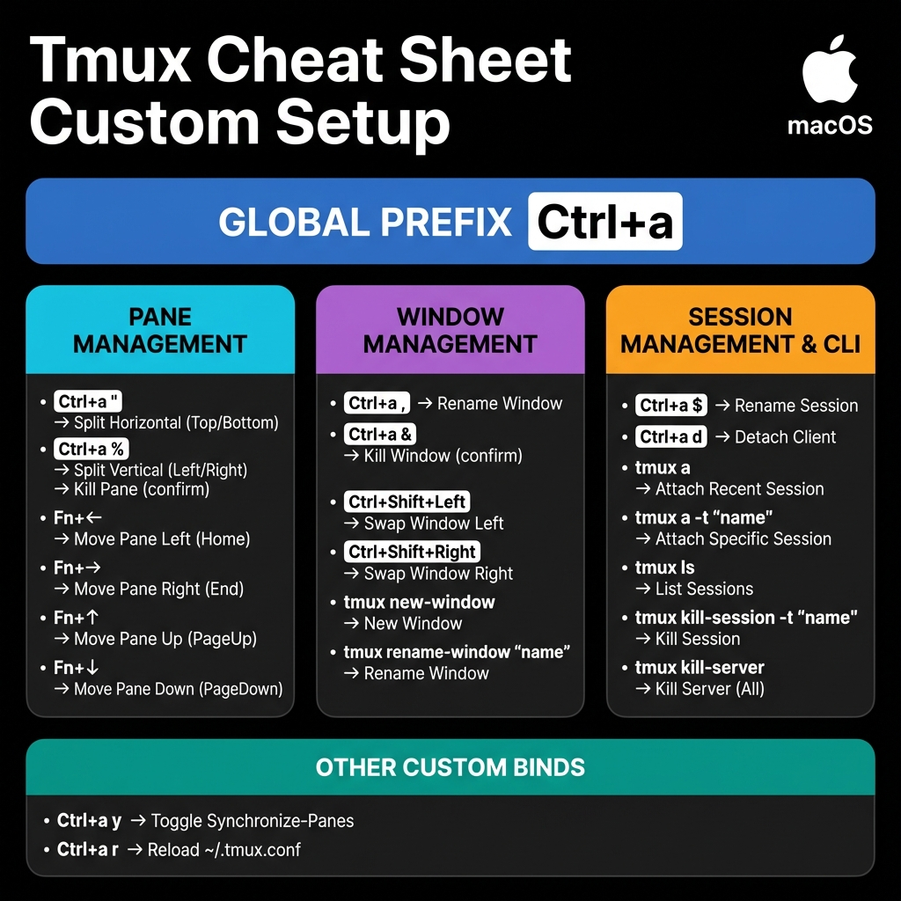

# Tmux Config

My personal tmux configuration for macOS.

## Installation

1. Clone this repository:

   ```bash
   git clone https://github.com/rohithgoud30/tmux-config.git ~/tmux-config
   ```

2. Create a symlink to use this config:

   ```bash
   ln -s ~/tmux-config/tmux.conf ~/.tmux.conf
   ```

   Or simply copy the file:

   ```bash
   cp ~/tmux-config/tmux.conf ~/.tmux.conf
   ```

3. Reload tmux (if already running):
   ```bash
   tmux source-file ~/.tmux.conf
   ```

## Cheatsheet



## Requirements

- macOS (uses Fn + Arrow keys which map to Home/End/PageUp/PageDown)
- tmux 3.0+

## Customization

You can fork this repository and customize `tmux.conf` to fit your workflow.
